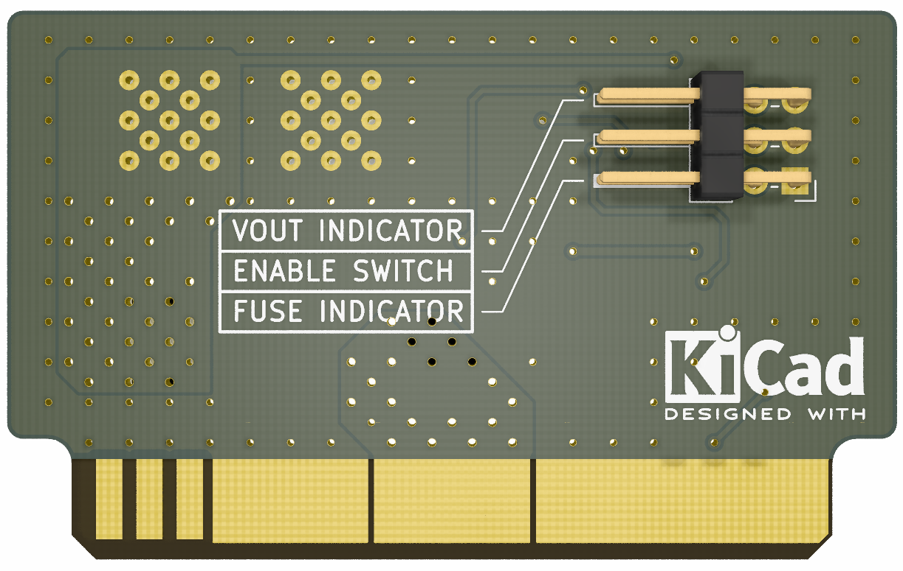

# plug-in-supply-distributor

## Overview

This is one of the boards under development by OUXT for the RobotX competition. It is part of the power supply system for the controller, and has connector interlocking, simple reverse voltage protection, fuse monitoring and external input functions.

KiCAD ( https://www.kicad.org/ ) is used for circuit design and PCB layout.

## CAD

### Version

KiCAD 5.1.7

### Parts Library

The symbol libraries and footprint libraries used in this schematic and PCB layout are basically KiCAD standard libraries, but some of them are in the following repositories.

https://github.com/alnicomag/kicad-custom-lib

## PCB rendering images

## Schematics

